# 🎬 Cine Spoilerss

Aplicación web desarrollada con React, TypeScript y Vite para explorar películas mediante datos locales y consumo de una API externa utilizando TMDB (The Movie Database).

---

# 🚀 Tecnologías Utilizadas

* React
* TypeScript
* Vite
* React Router DOM
* Axios
* TanStack React Query
* Tailwind CSS
* Shadcn UI
* TMDB API

# 📸 Evidencias de Sheila Diaz

## Evidencia 01: Instalación y Configuración de Shadcn UI

Se realizó la instalación y configuración inicial de Shadcn UI para la construcción de componentes reutilizables dentro de la aplicación.

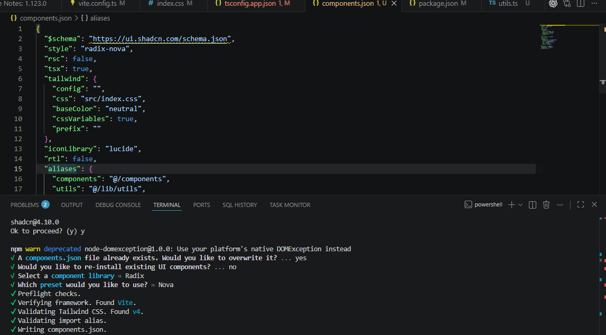

---

## Evidencia 02: Configuración de Rutas

Se implementó React Router DOM para gestionar la navegación entre páginas y rutas dinámicas dentro del proyecto.

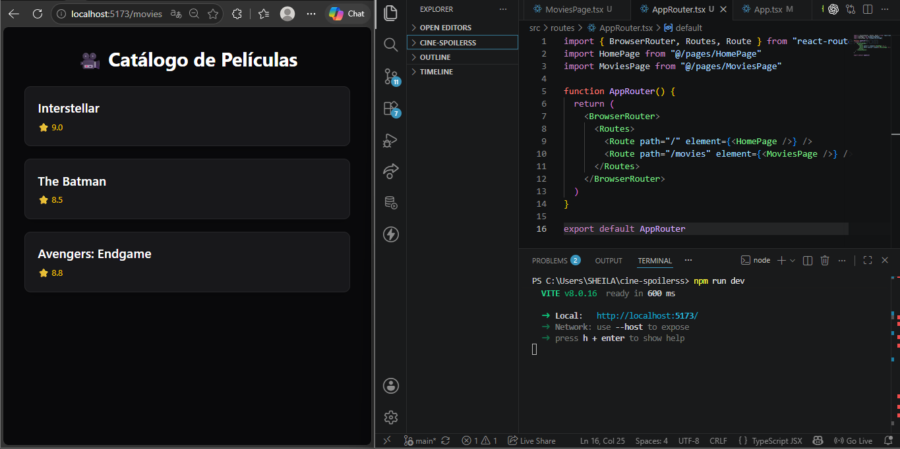

---

## Evidencia 03: Página Principal

Implementación de la página Home con diseño inicial y acceso al catálogo de películas.

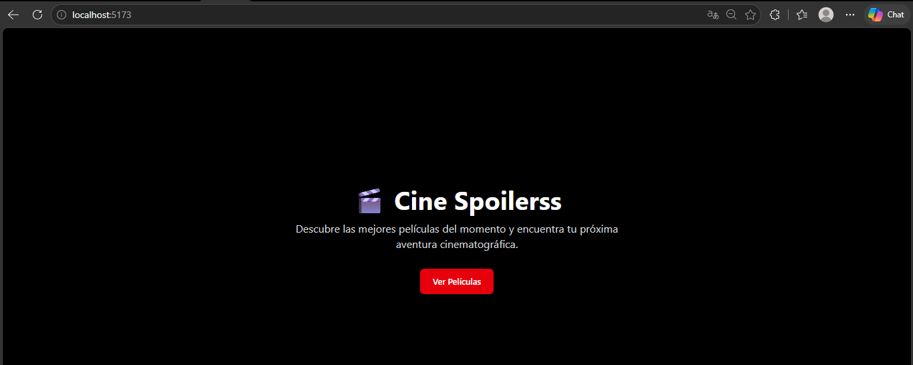

---

## Evidencia 04: Catálogo de Películas

Visualización de películas utilizando componentes reutilizables y estructura basada en TypeScript.

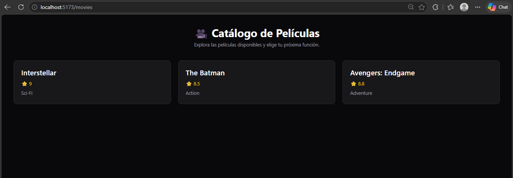

---

## Evidencia 05: Detalle de Película Local

Implementación de rutas dinámicas para visualizar información detallada de una película.

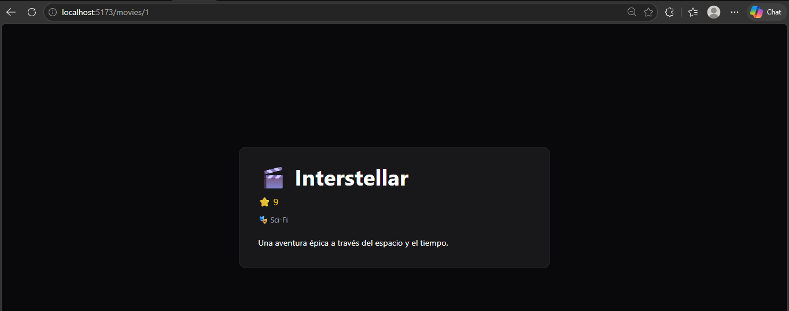

---

## Evidencia 06: Implementación de React Query

Configuración de TanStack React Query para la gestión eficiente del estado y consumo de datos.

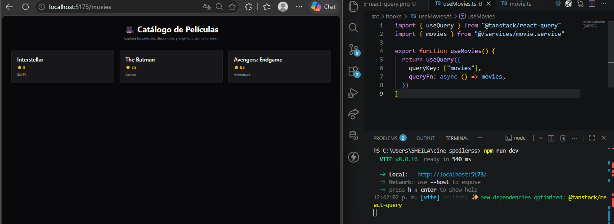

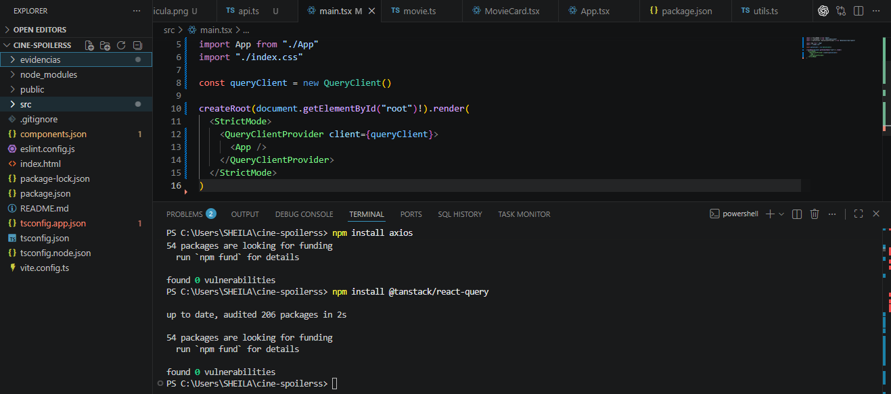

---

## Evidencia 07: Integración de Axios y React Query

Se implementó Axios para realizar solicitudes HTTP y React Query para administrar la información obtenida desde servicios externos.

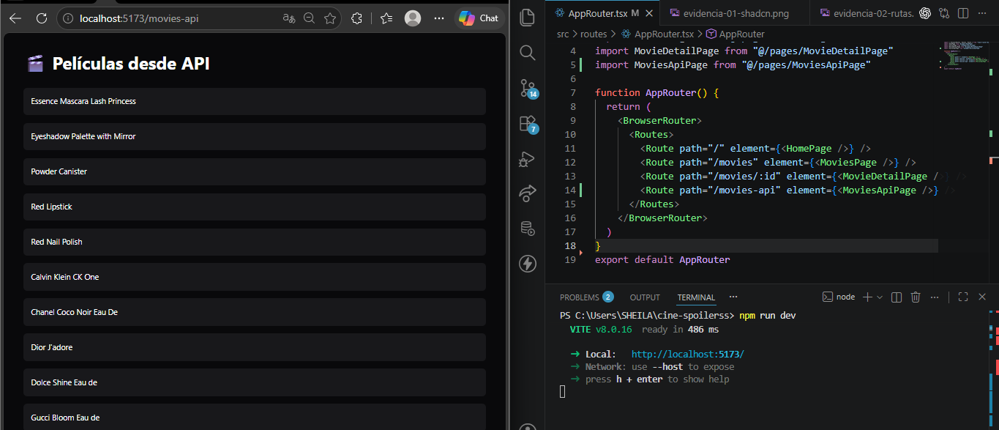

---

## Evidencia 08: Consumo de API TMDB

Conexión exitosa con The Movie Database (TMDB) para obtener información real de películas.

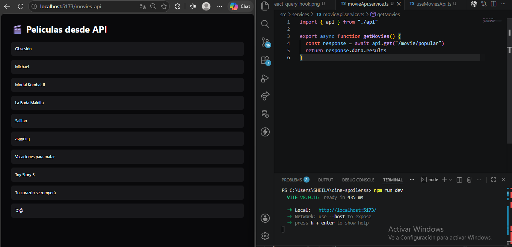

---

## Evidencia 09: Catálogo Visual con Posters

Visualización de posters, calificaciones y fechas de estreno obtenidas desde TMDB.

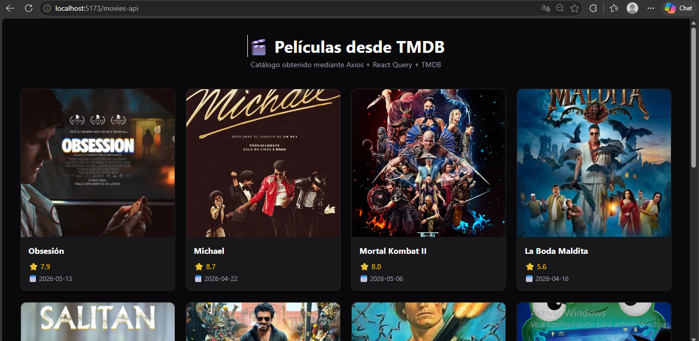

---

## Evidencia 10: Detalle de Película desde TMDB

Implementación del detalle completo de una película utilizando rutas dinámicas y consumo individual de la API TMDB.

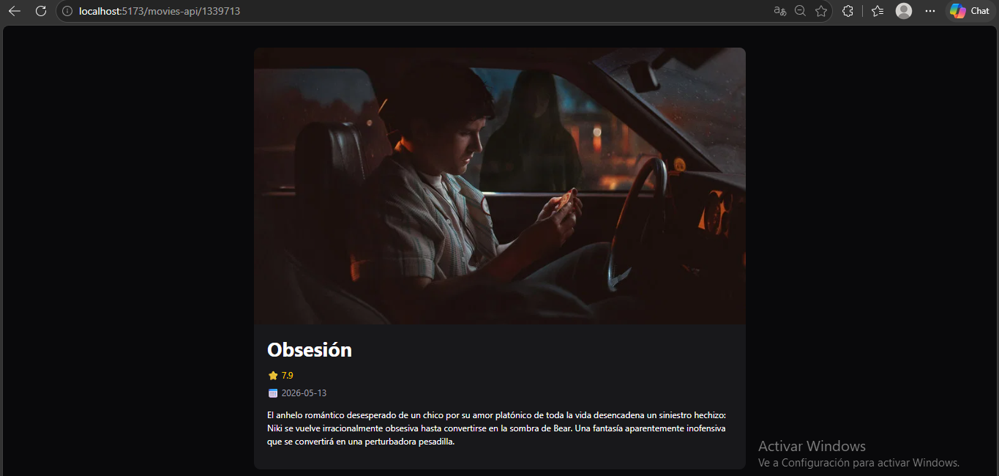

---

# 📸 Evidencias de Naomi Sanchez

## Evidencia 01: Inicialización de proyecto,Instalación y Configuración de Shadcn UI

Se realizó la instalación y configuración inicial de Shadcn UI para la construcción de componentes reutilizables dentro de la aplicación.

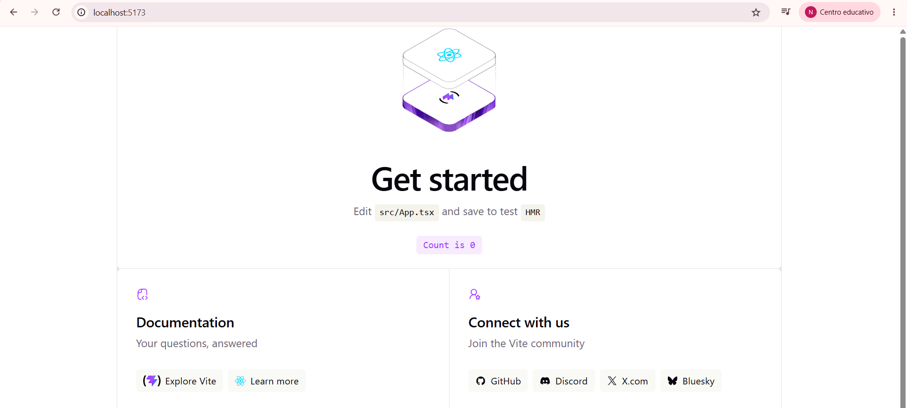
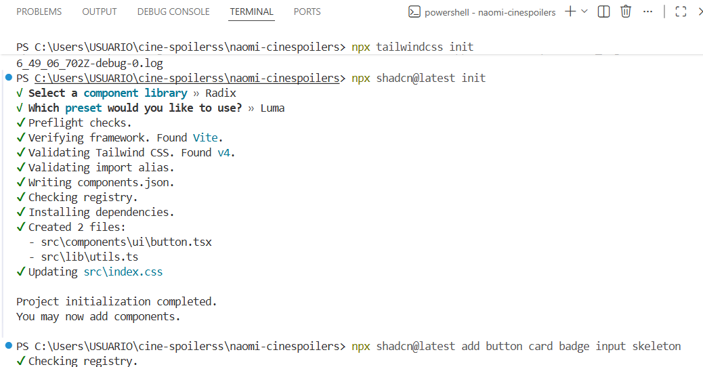
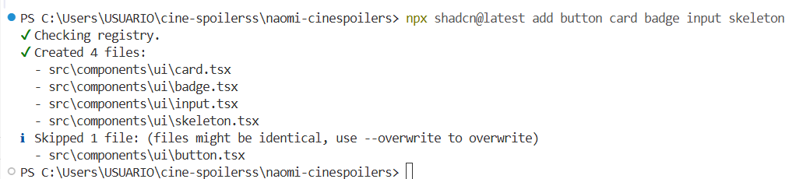

---

## Evidencia 02: Configuración de Rutas

Se implementó React Router DOM para gestionar la navegación entre páginas y rutas dinámicas dentro del proyecto.

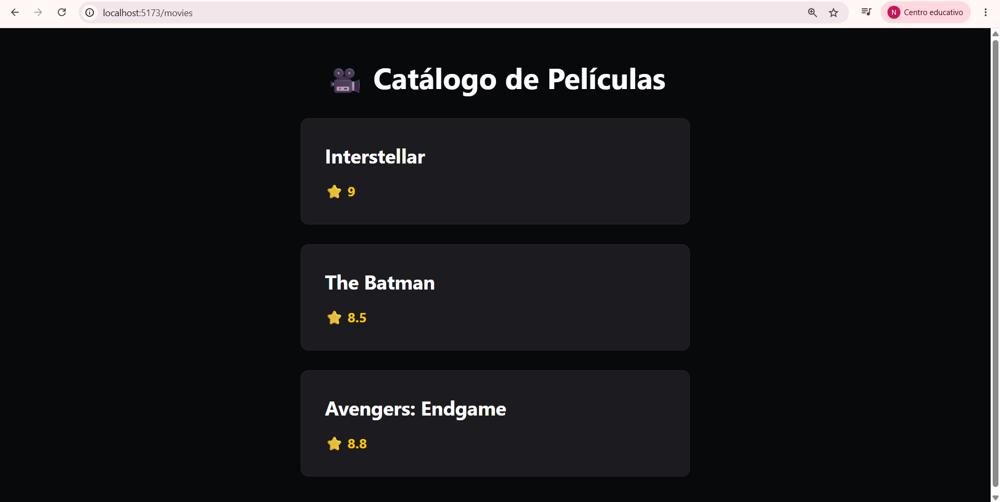

---

## Evidencia 03: Página Principal

Implementación de la página Home con diseño inicial y acceso al catálogo de películas.

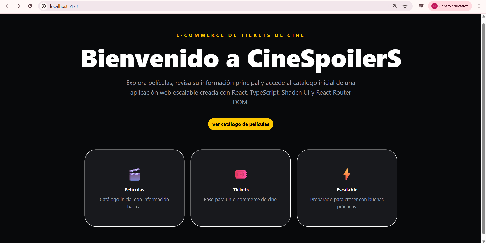

---

## Evidencia 04: Catálogo de Películas

Visualización de películas utilizando componentes reutilizables y estructura basada en TypeScript.

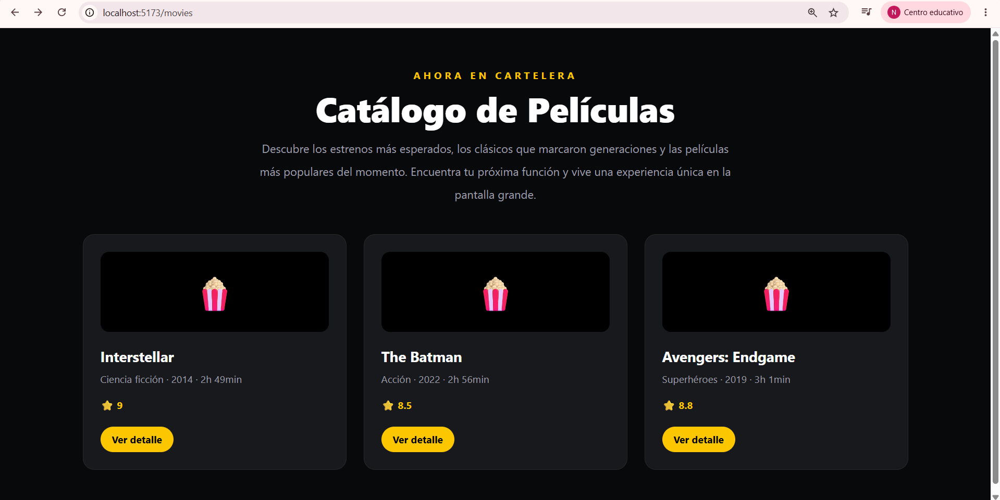

---

## Evidencia 05: Detalle de Película Local

Implementación de rutas dinámicas para visualizar información detallada de una película.

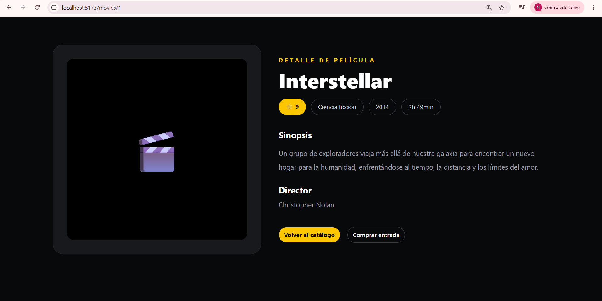
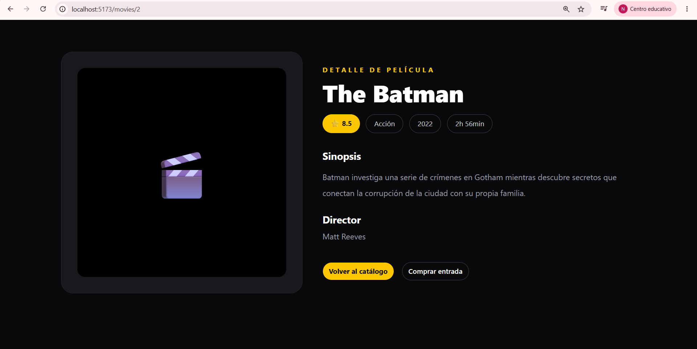
---

## Evidencia 06: Implementación de React Query

Configuración de TanStack React Query para la gestión eficiente del estado y consumo de datos.

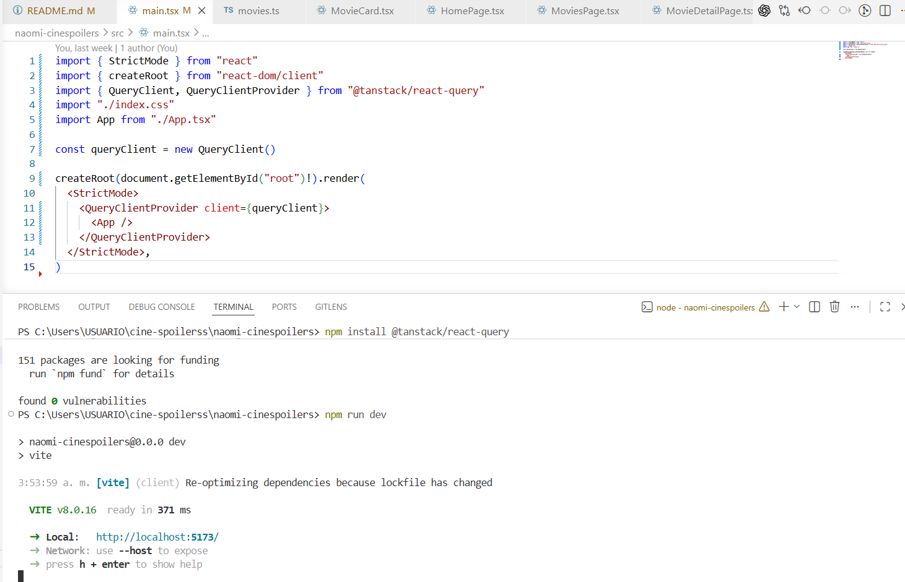

---

## Evidencia 07: Integración de Axios y React Query

Se implementó Axios para realizar solicitudes HTTP y React Query para administrar la información obtenida desde servicios externos.

---

## Evidencia 08: Consumo de API TMDB

Conexión exitosa con The Movie Database (TMDB) para obtener información real de películas.

---

## Evidencia 09: Catálogo Visual con Posters

Visualización de posters, calificaciones y fechas de estreno obtenidas desde TMDB.

---

## Evidencia 10: Detalle de Película desde TMDB

Implementación del detalle completo de una película utilizando rutas dinámicas y consumo individual de la API TMDB.

---

# 📌 Funcionalidades Implementadas

* Página principal (Home).
* Catálogo de películas.
* Detalle de película local.
* Navegación mediante React Router.
* Rutas dinámicas.
* Consumo de API mediante Axios.
* Gestión de datos con React Query.
* Consumo de información real desde TMDB.
* Visualización de posters y detalles de películas.
* Arquitectura organizada por capas.

